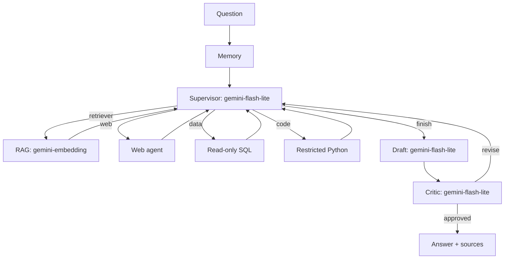

# Multi-Agent AI Analyst

A deployable capstone with a LangGraph supervisor that delegates to document retrieval, web search, read-only SQL, and constrained Python calculation agents. A critic checks the answer against gathered evidence before it is returned.



## Gemini proxy and secrets

All LangChain model calls use the class proxy at `https://saidazam-litellm-proxy.hf.space/v1`; the project makes no direct Google API calls.

| Purpose | Proxy model |
| --- | --- |
| Retrieval, SQL, code, drafting | `gemini-flash-lite` |
| Supervisor and critic | `gemini-flash-lite` |
| RAG and memory vectors | `gemini-embedding` |

1. Copy the root `.env.example` values into the existing root `.env` if needed.
2. Set `GEMINI_API_KEY` to your personal class key locally. Never commit or paste this value into source code.
3. Optional: add Tavily and Langfuse keys.

`.env` is ignored by Git. The checked-in `.env.example` contains no secret.

## Run locally

Requires Python 3.12+ and Node 20+.

```powershell
cd backend
python -m venv .venv
.\.venv\Scripts\Activate.ps1
pip install -r requirements.txt
uvicorn app.main:app --reload --port 8000
```

In a second terminal:

```powershell
cd frontend
Copy-Item .env.local.example .env.local
npm install
npm run dev
```

Open `http://localhost:3000`. Check `http://localhost:8000/docs` to ingest a text/PDF document before asking document-based questions. The API creates a seeded demonstration SQLite database automatically.

## Smoke test and checks

After installing backend dependencies and adding your key:

```powershell
cd backend
$env:PYTHONPATH = (Get-Location).Path
python scripts/test_proxy.py
pytest
python -m app.evaluate
```

The smoke test sends one harmless request through the proxy and never prints the key. `app.evaluate` runs the supplied ten-question test set both with and without the critic, then writes ignored local results (including RAGAS where available) to `backend/evaluation_results.json`.

## Safety controls

- SQL accepts a single `SELECT` or CTE query only, uses a read-only SQLite connection, and has a SQLite authorizer.
- Generated Python is AST-restricted (no imports/files/network/dunder access), runs in an empty temporary directory with isolated mode, and has a three-second timeout. For public production traffic, deploy this runner in its own container/microVM.
- The graph has both an agent-action cap and a LangGraph recursion limit.
- Missing Tavily is non-fatal; its agent records a skipped step.

## Deploy

### Backend on Render

1. Push this repository and create a Render Blueprint from `render.yaml` (or create a Docker web service with root directory `backend`).
2. Add `GEMINI_API_KEY` as a secret environment variable; set `FRONTEND_ORIGIN` to your Vercel URL after creating it. Add optional Tavily/Langfuse keys if used.
3. Deploy, then confirm `https://YOUR-API.onrender.com/health` returns `status: ok` and `gemini_key_configured: true`.

### Frontend on Vercel

1. Import the same repository, selecting `frontend` as the root directory.
2. Add `NEXT_PUBLIC_API_URL=https://YOUR-API.onrender.com`.
3. Deploy. Update Render's `FRONTEND_ORIGIN` to the exact Vercel URL and redeploy the API.

## Capstone evidence checklist

- Capture a UI trace showing supervisor → data/retriever/code → critic.
- Capture the Langfuse trace after adding Langfuse credentials; the LangChain callback is enabled automatically when both keys are present.
- Run the ten-case evaluation and record its output in your submission.
- Add three observed failures and their fixes to the error-analysis section of your report.
